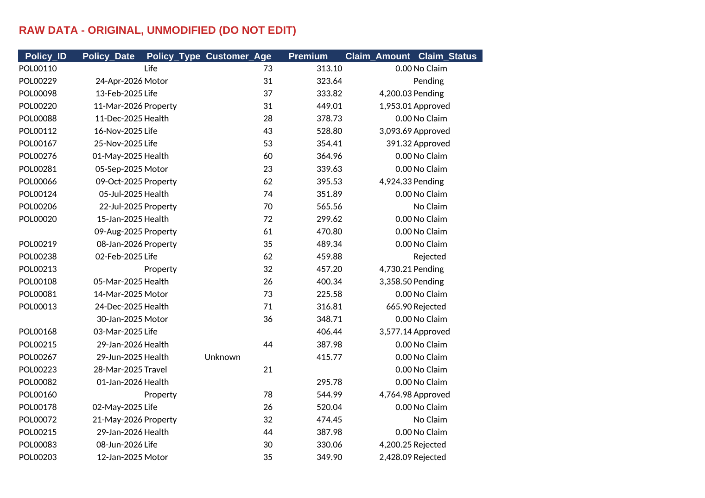
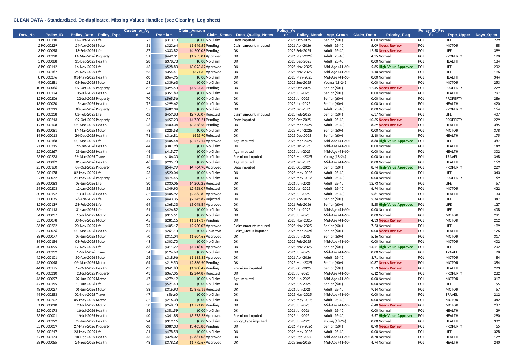
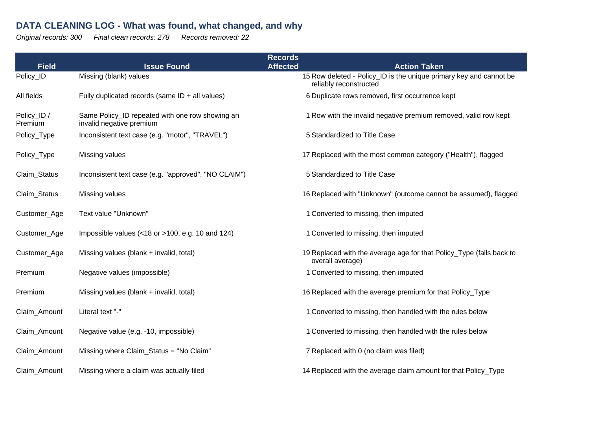
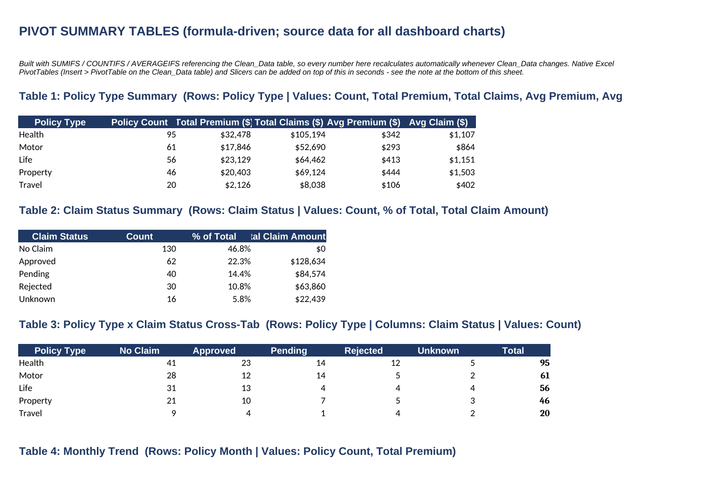
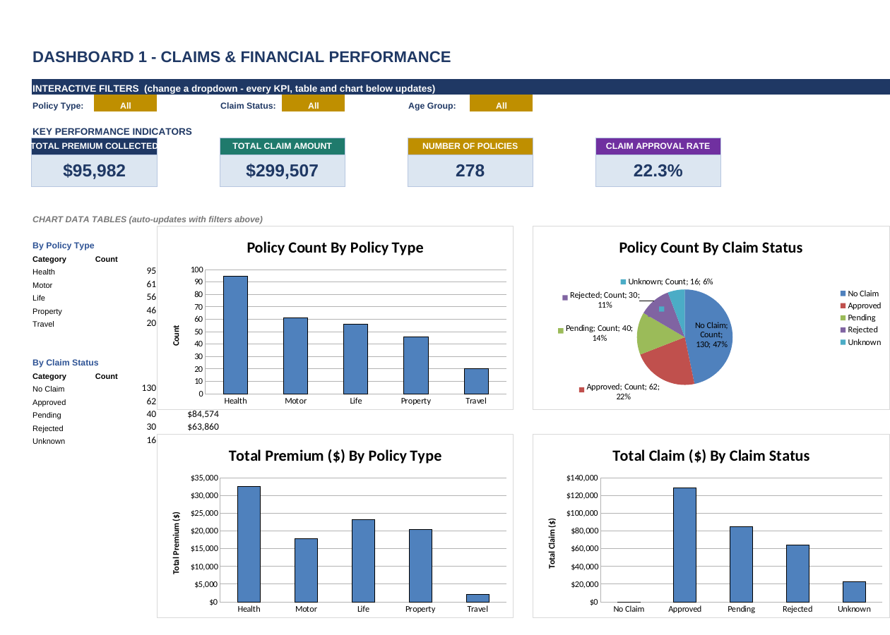
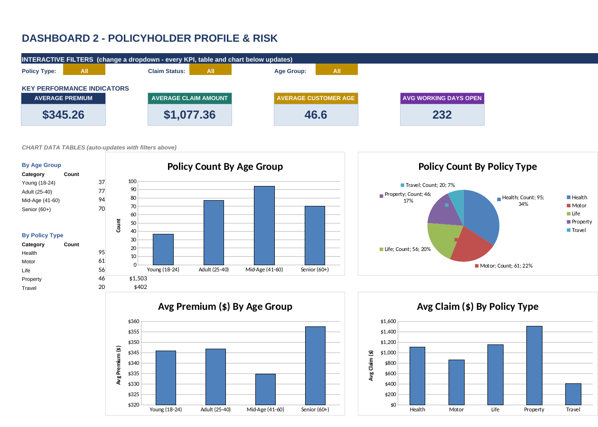
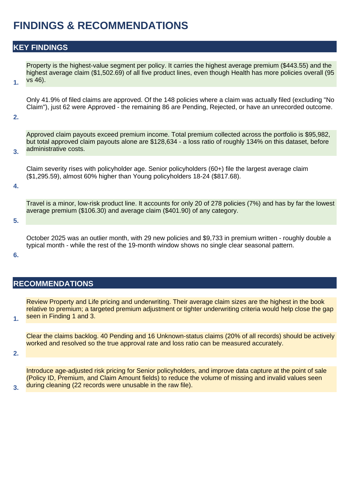

# 🚗 Insurance Data Analytics Project

**Prepared by:** Ramla Abdi Osman
**Institution:** Deero Institute
**Course:** Excel for Data Analysis
**Project Type:** Individual Project

---

## 📋 Project Overview

This project applies a complete Excel data analytics workflow — **Collect → Prepare → Clean → Analyze → Visualize → Present** — to a real-world insurance policy and claims dataset. The goal was to move from a raw, error-filled spreadsheet to a fully interactive, decision-ready analytics workbook.

```
RAW DATA → CLEAN DATA → FORMULAS → PIVOT TABLES → CHARTS → KPIs → DASHBOARDS → FINDINGS
```

## 📊 Dataset

| Detail | Value |
|---|---|
| Source file | `22_Insurance_Original_Raw.xlsx` |
| Raw records | 300 |
| Clean records | 278 |
| Variables | 7 original + 10 derived analysis columns |
| Policy types | Health, Motor, Life, Property, Travel |

---

## 🗂️ Repository Structure

```
├── Dataset/
│   ├── 22_Insurance_Original_Raw.xlsx        # Original, untouched source data
│   └── 22_Insurance_Data_Analytics_Project.xlsx   # Full workbook (8 sheets, live formulas)
├── PPT_file/
│   └── Insurance_Project_Presentation.pptx   # 7-slide project presentation
├── screenshots/
│   └── ...                                    # Visual walkthrough of every sheet
└── README.md
```

---

## 🧹 Part 1 — Data Cleaning

The raw dataset (300 records) contained missing IDs, duplicate rows, inconsistent text casing, impossible values, and blank fields. Every issue was identified, fixed, and logged.

**Raw data (untouched, as received):**



**22 records removed** (missing Policy_ID, exact duplicates, one invalid negative-premium duplicate) → **278 clean records** remained. Missing values were imputed using category averages (Premium, Claim_Amount, Customer_Age) or the dataset median (Policy_Date), and every change is flagged in a `Data_Quality_Notes` column with conditional formatting (color scale, data bars, rule-based highlighting):



A full audit trail of every fix — field, issue found, records affected, and action taken — is documented in the Cleaning Log:



---

## 🧮 Part 2 — Formulas & Analysis

The workbook demonstrates the full range of required Excel functions:

- **Basic:** `SUM`, `AVERAGE`, `COUNT`, `MIN`, `MAX`
- **Conditional:** `COUNTIF`, `SUMIF`, `AVERAGEIF`, `SUMIFS`
- **Logical:** `IF`, `IFS`, `AND`, `OR` → e.g. `Age_Group`, `Priority_Flag`
- **Date:** `YEAR`, `TODAY`, `NETWORKDAYS` → e.g. `Days_Open`
- **Text:** `LEFT`, `UPPER`, `TRIM`
- **Sorting & Filtering:** Full AutoFilter table + a Top-10 highest-claims extract via `LARGE` + `INDEX/MATCH`

## 📈 Part 3 — PivotTables & Visualization

Five formula-driven pivot summary tables (Policy Type, Claim Status, Cross-Tab, Monthly Trend, Age Group) feed 8 charts across the two dashboards — all built with `SUMIFS`/`COUNTIFS`/`AVERAGEIFS`, so every number recalculates automatically:



---

## 📊 Part 4 — Interactive Dashboards

Two dashboards, each with **4 KPI cards**, **4 charts**, and **3 interactive dropdown filters** (Policy Type, Claim Status, Age Group). Changing a filter instantly recalculates every KPI and chart on that dashboard.

### Dashboard 1 — Claims & Financial Performance


### Dashboard 2 — Policyholder Profile & Risk


---

## 🔎 Part 5 — Key Findings



1. **Property is the highest-value segment** — highest average premium ($443.55) and highest average claim ($1,502.69).
2. **Only 41.9% of filed claims are approved** (62 of 148 claims with an actual outcome).
3. **Loss ratio ≈ 134%** — approved claim payouts ($128,634) exceed total premium collected ($95,982).
4. **Claim severity rises with age** — Seniors (60+) average $1,295.59 per claim vs. $817.68 for Young policyholders.
5. **Travel is the smallest, lowest-risk line** — 20 policies, $106.30 avg premium, $401.90 avg claim.
6. **October 2025 was an outlier month** — 29 new policies and $9,733 in premium, roughly double a typical month.

## ✅ Recommendations

1. **Reprice Property & Life** — their claim sizes are highest relative to premium; tighten underwriting or adjust pricing.
2. **Clear the claims backlog** — 40 Pending + 16 Unknown-status claims (20% of the book) need resolution.
3. **Introduce age-adjusted pricing** and improve data capture at the point of sale to reduce future missing/invalid values.

---

## 🛠️ Tools Used

- Microsoft Excel (formulas, conditional formatting, charts, data validation)
- PowerPoint (project presentation)

## 📂 How to Use

1. Download `Dataset/22_Insurance_Data_Analytics_Project.xlsx`
2. Open the `Dashboard_Claims` or `Dashboard_Profile` sheet
3. Use the dropdown filters at the top to explore the data interactively
4. See `PPT_file/` for the full project presentation

---

*This project was completed as part of the Excel for Data Analysis course at Deero Institute.*
